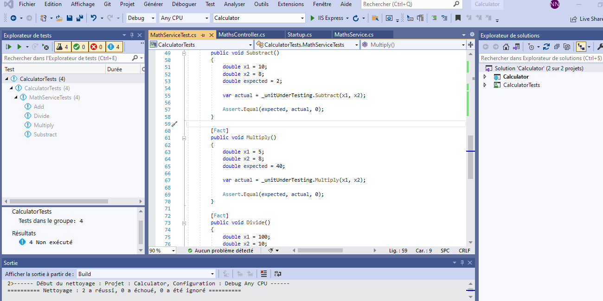
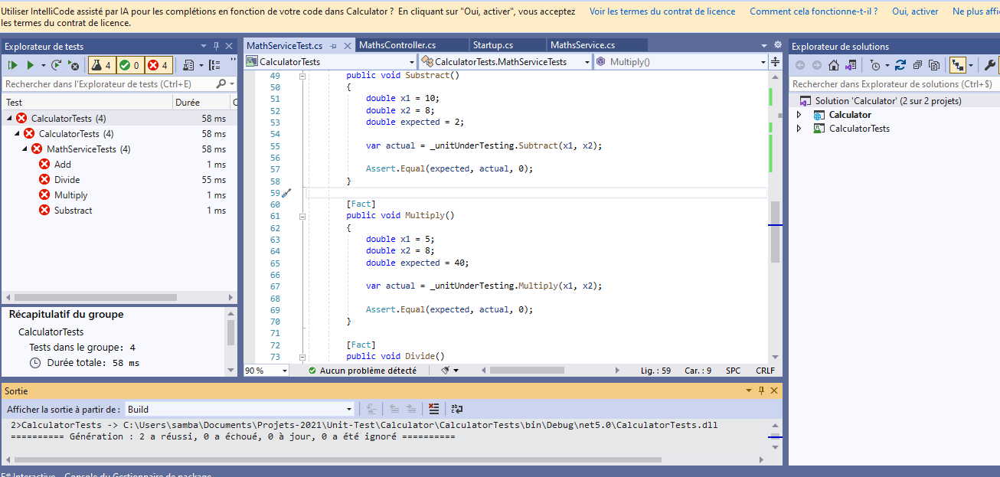
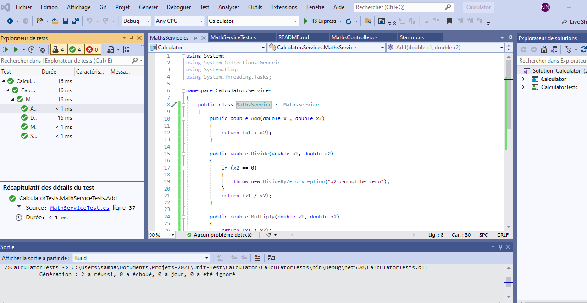
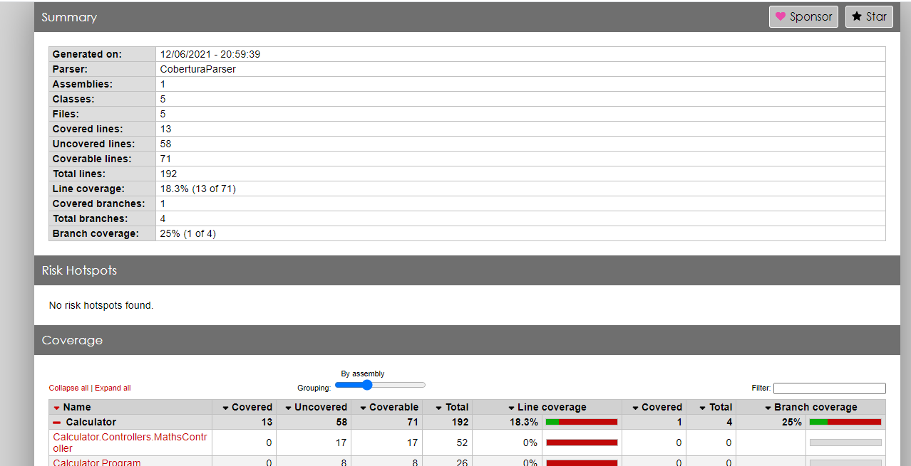
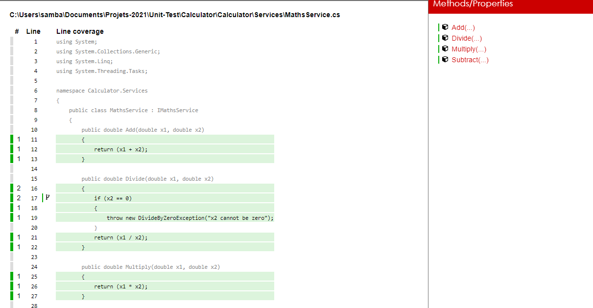

# Implement Unit Testing in ASP.NET Core 5

### Content - :
xUnit.net
xUnit.net is the newest unit testing framework for .NET projects and
gained lots of popularity when Microsoft started using it for ASP.NET 
Core.
xUnit.net can be used to implement unit testing in ASP.NET Core &
.NET Full framework as well. 

### Code Coverage Report
This report is used to check whether we have covered complete code of system under test in unit
cases or not. i.e. our unit cases are able to test all the functionality provided in system
under test (in this case MathsService) or not.

To be able to use code coverage report we need to install tool reportgenerator using the command as shown below

		dotnet tool install -g dotnet-reportgenerator-globaltool

To capture data for the code coverage report we need to run the below command from the command-line tool.
This command will generate an XML file named coverage.cobertura.xml on path TestResults\guid\.

		dotnet test --collect:"XPlat Code Coverage"

After the above XML file has been generated run the below command to generate a code coverage report, 
in this command you need to specify the path to coverage.cobertura.xml and also specify 
the report type which has been set to Html in the below command.

reportgenerator "-reports:path\to\TestResults\guid\coverage.cobertura.xml" "-targetdir:coveragereport" -reporttypes:Html

### `Screen shot`
 
 
 
 
 
  

